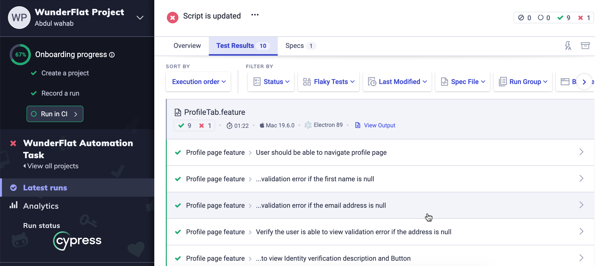
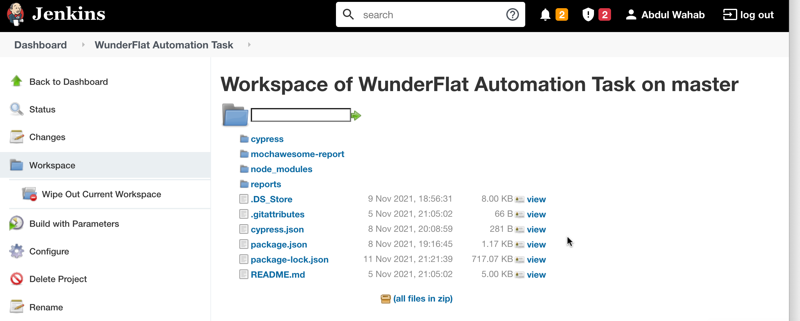
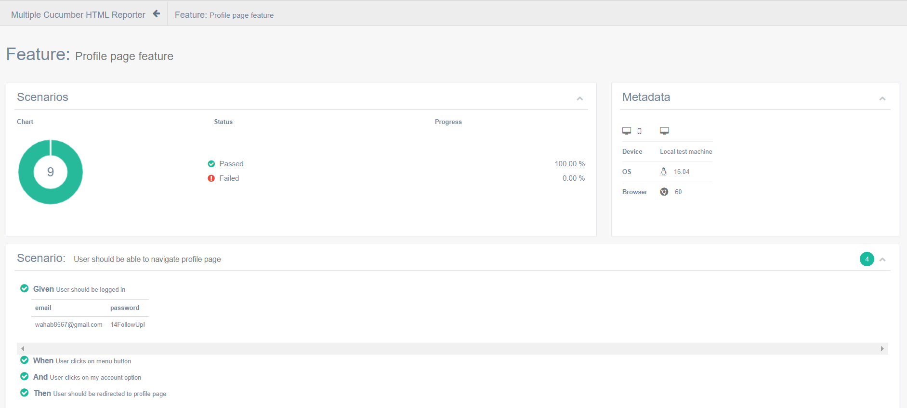

<h1 align="center">WunderFlats Automation Task </h1>
 <p align="center">
 
   
  
 </p>

This is a task to Automate [https://en-hiring.wunderflats.xyz/en/login?redirect=%2Fen](https://en-hiring.wunderflats.xyz/en/login?redirect=%2Fen) website using Cypress and Cucumber with Mochawesome report, Please see below for the Test Case that are automated 

<h1 align="center">WunderFlats Profile Automation Demo  </h1>

<p align="center"> 
  <kbd>
  	<a href="#" target="_blank">
		</img>
	</a>
  </kbd>
</p>


## Requirements

- Any computer: Mac, Windows, Linux
- Node 12.0.0+ (LTS)
- git

## About project

- Cypress is used as Test automation framework 
- Behavior Driven Development (BDD), Cucumber is implemented
- Page object model is used in order to create object repository for storing web elements
- For reports cucumber-html-reporter is used
- Cypress parallel is implemented to execute test in parallel
- cucumber-json-merge is used to consolidate test
- Used chai-sorted assertion
- Ingtegrate cypress project with Jenkins and cypress Dashboard 

### In order to get the code and install dependencies (Run Locally 🚀)

- ``` git clone https://github.com/AbdulWahab0/Wunderflats-Automation_Project.git ```
- ``` cd Wunderflats-Automation_Project ```
- ``` npm install ```
-  ``` npm start ``` or Run: ```npx cypress open ```
-  ```Click on feature file  (ProfileTab.feature) to run the Automated test  ``` \
- Let me know if you have any questions. [Email Abdul Wahab ](mailto:wahab3060h@gmail.com)

### Enter the following commands in terminal in order to  run the Cypress test Runner

- ``` npx cypress open ```

### Enter the following commands in terminal in order to execute test on electron  in headless mode


- ``` npm run electronTest ```

### Following is the report path

reports/cucumber-htmlreport.html/index.html

### Following is the Bug Report for Profile Page

cypress/Bug_Report/Defect_report_WunderFlats.pdf

### Following is Test Plan Document 

cypress/Test_Strategy/Test_Strategy.pdf

### Following is the Manual Test cases Excel file

cypress/Manual_Test_Cases/Manual_Test_Case.xlsx

### Autmated test case Demo Vidoes

failed test screenshot available at:/cypress/videos

## Technology used:

 - Cypress 
 - Cucumber
 - Mochawesome
 - Jenkins
 
## Cypress Test Automation  Results 


<p align="center"> 
  <kbd>
  	<a href="#" target="_blank">
		</img>
	</a>
  </kbd>
</p>

## Cypress Test on Cypress Dashboard


<p align="center"> 
  <kbd>
  	<a href="#" target="_blank">
		</img>
	</a>
  </kbd>
</p>

## Cypress Project Integerate with jenkin


<p align="center"> 
  <kbd>
  	<a href="#" target="_blank">
		</img>
	</a>
  </kbd>
</p>

## Test Results 
✔️ Multiple Cucumber Html Reports

<p align="center"> 
  <kbd>
  	<a href="#" target="_blank">
		</img>
	</a>
  </kbd>
</p>


**General Test Cases for Profile Page**

| Number | Test Case  |
|--|--|
|1  | Verify profile URL [https://en-hiring.wunderflats.xyz/en/account/profile](https://en-hiring.wunderflats.xyz/en/account/profile) |
|2|Verify profile page Url is accessible  in incognito window(Secuirty Check).|
|3  | Verify all fileds  & Validtaions  in the German language |
|4  | Verify bubble count in the  profile tab|
|5  |Verify   profile page header tabs  |
|6  |Verify   profile footer tabs  |
|7  | Verify my account tabs (Profile,Documents,Settings) |
|8  |Verify that Enter/Tab key works|
|9  | Verify that entering blank spaces on mandatory fields|
|10 |Verify proile progress ring |


**Full Name Test Cases.**  


| Number | Test Case |
|--|--|
|1  |  Verify  edit/update full name |
|2  |Verify full name mandatory fileds|
|3  | Verify full name validation with special characters|

**Email Test Cases.**  


| Number | Test Case |
|--|--|
|1  |  Verify  edit/update Email Address |
|2  |Verify Email Address mandatory fileds| 
|3  |Verify email  validation With special characters|
|4  |Verify  already existing email validation |
|5  |Verify change email and confirm your new address |

**Phone Number Test Cases.**  


| Number | Test Case |
|--|--|
|1  |  Verify  edit/update Phone Number |
|2  |Verify Phone Number  mandatory fileds| 
|3  |Verify  phone number country code matches with country flag |
|4  |Verify  mobile number length |
|5  |Vefiy  mobile number code matches  with selected country |
|6  |Verify available list of countries for phone number|
|7  |Verify passing alphanumeric data in phone number |

**Address Test Cases.**  


| Number | Test Case |
|--|--|
|1 |Verify  edit/update Address |
|2 |Verify Address mandatory fileds| 
|3 |Vefiy address suggestion  list from Google  |
|4 |Verify list of countries for address  |


**Identity verification Test Cases**  


| Number | Test Case |
|--|--|
|1  |Verify  Identity verification card with description |
|2  |Verify start verifcation button | 
|3  |Verify verication conformation link by cell humber   |

**Birth date Test Cases.**  


| Number | Test Case |
|--|--|
|1  |  Verify  edit/update Birth date |
|2  |Verify Birth date mandatory fileds| 
|3  |Verify date of birth greater than current date |
|4  |Verify all Zeros in the birth date |

**Nationality date Test Cases.**  


| Number | Test Case |
|--|--|
|1  |  Verify  edit/update nationality |
|2  |Verify nationality  mandatory fileds| 
|3  |Verify list of countries nationalites|
|4  |Verify all Zeros in the birth date |


## Contributors ✨
<table>
  <tr>
    <td align="center"><a href="https://github.com/AbdulWahab0"><br /><sub><b>Abdul Wahab</b></sub></a><br /><a href="https://github.com/AbdulWahab0" title="Code">💻</a> <a href="https://github.com/AbdulWahab0" title="Documentation">📖</a> <a href="https://github.com/AbdulWahab0" title="Design">🎨</a> <a href="https://github.com/AbdulWahab0" title="Maintenance">🚧</a></td>
  </tr>
</table>


 
